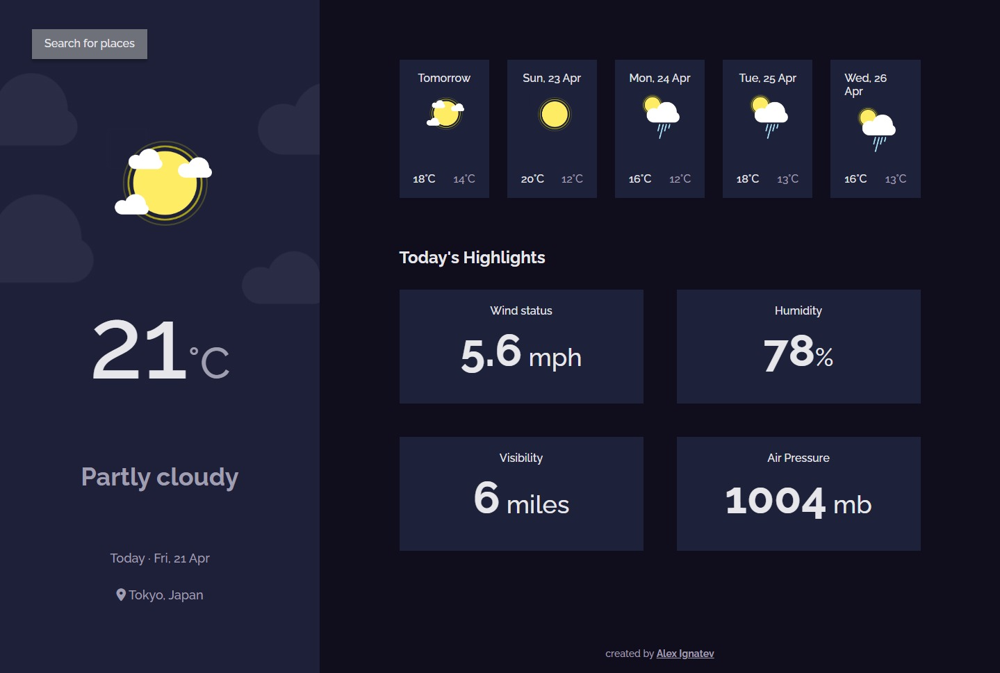

# The Odin Project - JavaScript Course

## Project: Weather App

## [Live](https://alexign473.github.io/weather-app/)

Search for forecast the weather. Using fetch and [weatherapi](https://www.weatherapi.com/).

## Built with

- HTML
- SCSS
- JavaScript
- Webpack
- ESLint + Airbnb JavaScript Style Guide
- Prettier

## Installation

1. Clone the repo

2. Install the required dependencies by using:  
   `npm install`

3. Start the Dev server:  
   `npm start`

4. Distribution files can be produced using:  
   `npm run build`
